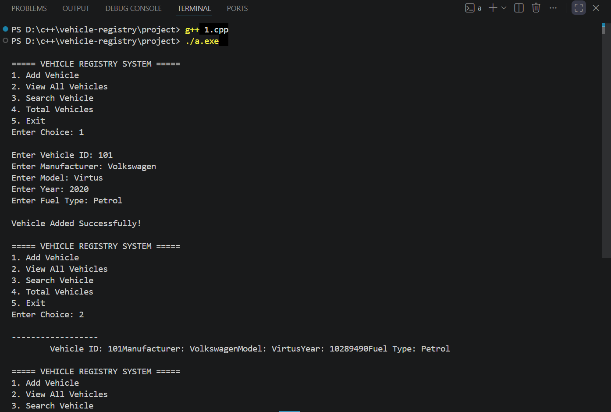

<h1>Vehicle Registry System</h1>

Vehicle Registry System - Project Description

The Vehicle Registry System is a C++ console-based application developed using Object-Oriented Programming (OOP) concepts. The system allows users to add, view, and search vehicle records through a menu-driven interface.

The project demonstrates important OOP features such as Encapsulation, Constructors, Destructors, Static Members, Arrays of Objects, and Different Types of Inheritance including Single, Multilevel, Multiple, and Hierarchical Inheritance. A base class Vehicle stores common vehicle information such as Vehicle ID, Manufacturer, Model, and Year, while derived classes represent different vehicle categories like Car, Electric Car, Sports Car, Flying Car, Sedan, and SUV.

The VehicleRegistry class manages the collection of vehicle records and provides functionalities to add new vehicles, display all registered vehicles, and search vehicles by their ID. The system also keeps track of the total number of vehicles created using a static member variable.

This project helps in understanding how real-world entities can be modeled using object-oriented programming principles in C++.

